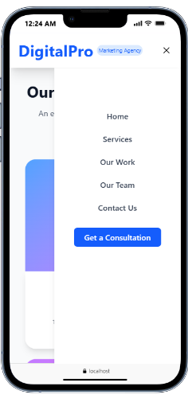
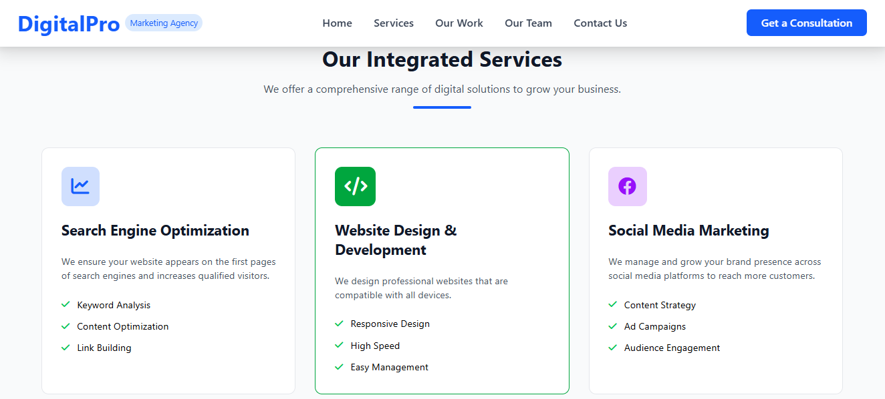

# DigitalPro Website

A modern responsive business website built with **React + Vite + TailwindCSS**.
The website includes a services section, team section, contact form, and Google Maps integration.

---

## 🚀 Features

* Responsive design for all devices
* Modern UI using TailwindCSS
* Contact form section
* Social media icons
* Google Maps location
* Clean and reusable React components

---

## 🛠️ Technologies Used

* React
* Vite
* Tailwind CSS
* Font Awesome
* Google Maps Embed

---

## 📸 Screenshots

### Home Page





### Services Section


---

## 📦 Installation

Clone the repository

```bash
git clone https://github.com/MahmoudGado1/landing-page.git
```

Go to project folder

```bash
cd digitalpro-website
```

Install dependencies

```bash
npm install
```

Run the development server

```bash
npm run dev
```

---

## 📁 Project Structure

```
src
 ├─ components
 │   ├─ Navbar.jsx
 │   ├─ Services.jsx
 │   ├─ Team.jsx
 │   └─ Footer.jsx
 |   ├ hero.jsx
 ├─ App.jsx
 └─ main.jsx

public
 ├─ 1.png
 ├─ 2.png
 ├─ 3.png
 └─ 4.png
```

---

## 🌍 Live Demo

You can deploy the project using:

* Vercel
* Netlify
* GitHub Pages

---

## 👨‍💻 Author

Mahmoud Gado


